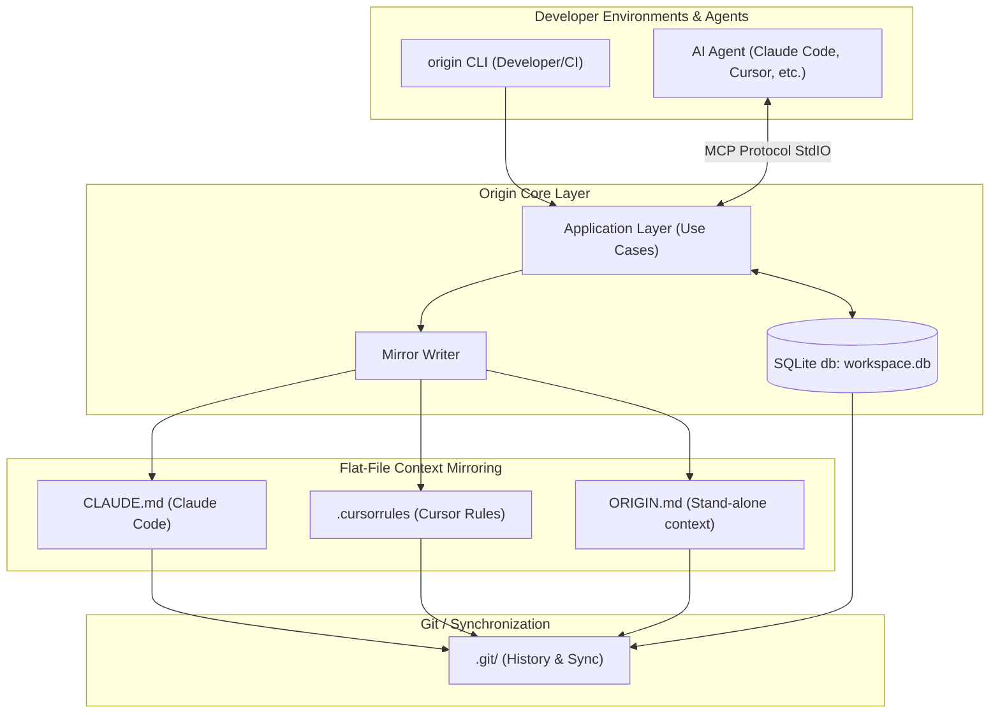
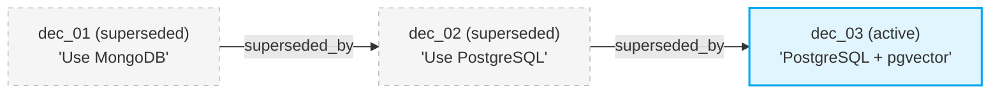

# ✨ Origin

[](LICENSE)
[](pyproject.toml)
[](CONTRIBUTING.md)

**Origin** is a local-first, git-friendly persistent memory layer for AI coding agents. It solves a single core problem: every AI assistant (Claude Code, Cursor, Windsurf, etc.) begins every session with zero context about your project's architecture, historical decisions, and active conventions. Origin acts as a persistent brain, recording that knowledge as typed, versioned artifacts committed directly to your repository.

---

## 🛠️ System Architecture

Origin links your CLI inputs or AI agent MCP tool calls directly into an application service layer backed by a single-table SQLite database. Change details are mirrored into clean Markdown files committed directly to Git, which agents read naturally.



---

## 🚀 Quickstart

### 1. Installation
Install the package locally:
```bash
pip install -e .
```

### 2. Initialize Origin Workspace
Run this inside your project root directory:
```bash
origin init --name MyAwesomeProject --with-hooks
```
This generates a `.origin/` directory with:
- `config.yaml`: schema configurations.
- `workspace.db`: your local single-table SQLite store.
- Auto-generated mirrors: `decisions.md`, `memory.md`, and `ORIGIN.md`.

### 3. Record Your First Decision
```bash
origin decision add \
  --title "Use PostgreSQL over MongoDB for data layer" \
  --rationale "Strong transactional integrity and native JSON support required." \
  --confidence 0.95 \
  --alternative "MongoDB" \
  --alternative "SQLite" \
  --file "src/db.py"
```

### 4. Keep Agent Context Up to Date
```bash
origin export --target claude-code
```
This appends/updates a marked context block inside `CLAUDE.md` without clobbering your existing file contents!

---

## 🧬 Decision Supersession Chain

When requirements evolve, you can supersede old decisions. Origin preserves the entire historical chain in your database, letting agents inspect *why* changes occurred.



To supersede a decision:
```bash
origin decision supersede dec_01KXBTA5DD6... \
  --title "PostgreSQL + pgvector for embedding support" \
  --rationale "Product requirements shifted to support semantic search indices locally." \
  --confidence 0.90
```

---

## 🔌 Utilizing the MCP Server

Origin includes a built-in Model Context Protocol (MCP) server allowing AI agents to query and add project memory directly.

### Get registration snippet
```bash
origin mcp-config
```
This prints the JSON configuration snippet to register the `origin-mcp` command with Claude Code or Claude Desktop.

Example configuration:
```json
{
  "mcpServers": {
    "origin-memory": {
      "command": "origin-mcp",
      "args": []
    }
  }
}
```

### Available MCP Tools:
- `origin_get_context()`: returns the compiled markdown context bundle.
- `origin_add_decision(...)`: records a new decision.
- `origin_list_decisions(status)`: lists active or superseded ADRs.
- `origin_supersede_decision(...)`: chains a new decision over an old one.
- `origin_set_memory(...)`: updates project conventions.
- `origin_search(...)`: runs SQL searches across key findings.

---

## 🛠️ Command-Line Interface Reference

| Command | Description |
| :--- | :--- |
| `origin init` | Creates `.origin/` folder, configuration, and SQLite store |
| `origin decision add` | Record new architecture decision (interactive or flags) |
| `origin decision list` | Lists decisions filtered by status (active/superseded) |
| `origin decision supersede <id>` | Marks old decision as superseded and links a new one |
| `origin memory set <cat> <key> <val>`| Stores or updates a project memory entry |
| `origin memory get <cat> <key>` | Prints the raw value of a memory key to stdout |
| `origin context` | Prints the compiled context bundle |
| `origin search <query>` | Keywords search across decisions and memories |
| `origin export --target <target>` | Exports context to `claude-code`, `cursor`, or `generic` |
| `origin doctor` | Workspace sanity check, git status, and integrity diagnostics |

---

## 🤝 Contributing

We welcome contributions! Please review [CONTRIBUTING.md](CONTRIBUTING.md) to set up your local development environment, learn how to run tests, and discover how to write custom flat-file exporters.

---

## ⭐ Star the Repo!

If you find Origin helpful for pair programming with AI agents, please **star this repository** to help others discover it!

*Built with ❤️ by the Advanced Agentic Coding Team.*
