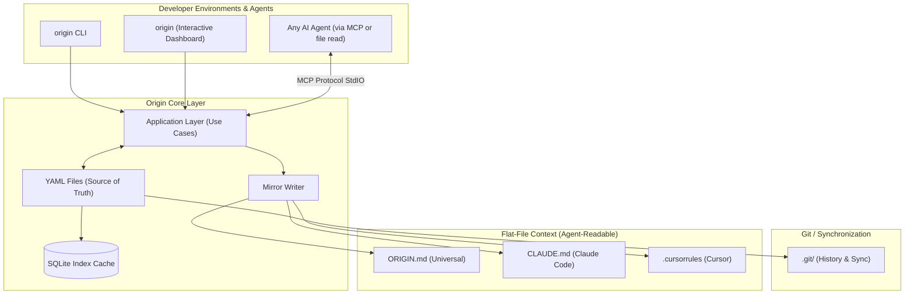
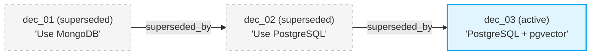

# ⚛️ Origin

[](LICENSE)
[](pyproject.toml)
[](CONTRIBUTING.md)

**Origin** is a local-first, git-friendly persistent memory layer for AI coding agents. It solves a single core problem: every AI assistant — Claude Code, Cursor, Windsurf, Codex CLI, Aider, or any MCP-compatible tool — begins every session with zero context about your project's architecture, historical decisions, and active conventions. Origin acts as a persistent brain, recording that knowledge as typed, versioned artifacts committed directly to your repository.


> **Works with any agent.** Origin exports context as plain Markdown files (`ORIGIN.md`, `CLAUDE.md`, `.cursorrules`) and exposes an MCP server that any compatible client can connect to. If your agent reads files or speaks MCP, it works with Origin.

---

## ⚙️ System Architecture

Origin stores each artifact as an individual YAML file (git-mergeable, human-readable), backed by a rebuildable SQLite query cache. Three thin adapter layers — CLI, MCP server, and interactive TUI — all route through a shared application service layer. Markdown mirrors are committed to Git for agent consumption.



---

## 🚀 Quickstart

### 1. Installation
Install the package globally or in your python environment:
```bash
pip install -e .
```

### 2. Initialize Origin Workspace
Run this inside your project root directory:
```bash
origin init --name MyAwesomeProject --with-hooks
```
This generates a `.origin/` directory with:
- `config.yaml`: schema configurations.
- `workspace.db`: your local single-table SQLite store.
- Auto-generated mirrors: `decisions.md`, `memory.md`, and `ORIGIN.md`.

### 3. Record Your First Decision
```bash
origin decision add \
  --title "Use PostgreSQL over MongoDB for data layer" \
  --rationale "Strong transactional integrity and native JSON support required." \
  --confidence 0.95 \
  --alternative "MongoDB" \
  --alternative "SQLite" \
  --file "src/db.py"
```

### 4. Keep Agent Context Up to Date
```bash
# Universal — works with any agent that reads project files
origin export --target generic

# Or target a specific editor
origin export --target claude-code   # writes CLAUDE.md
origin export --target cursor        # writes .cursorrules
```
This appends/updates a marked context block inside the target file without clobbering your existing contents.

---

## 🔗 Decision Supersession Chain

When requirements evolve, you can supersede old decisions. Origin preserves the entire historical chain in your database, letting agents inspect *why* changes occurred.



To supersede a decision:
```bash
origin decision supersede dec_01KXBTA5DD6... \
  --title "PostgreSQL + pgvector for embedding support" \
  --rationale "Product requirements shifted to support semantic search indices locally." \
  --confidence 0.90
```

---

## 🖥️ Interactive TUI Dashboard

Launch a real-time, keyboard-navigable terminal dashboard with `origin`. It leverages a modern, input-driven Claude Code-style UI with a custom 8-bit Atom logo and persistent header.

```bash
origin
```

### Command Prompt & Navigation

At the bottom of the TUI is an interactive Command Input bar. You can type slash commands directly or enter keywords to query the workspace:

| Tab / Command | Key Shortcut | Description |
| :--- | :--- | :--- |
| `1` / `/overview` | `1` | Home View with Welcome Screen and dynamic System Diagnostics |
| `2` / `/decisions` | `2` | Interactive Decisions View with list groups and side inspector |
| `3` / `/knowledge` | `3` | Collapsible Memory list grouped by category with side inspector |
| `4` / `/timeline` | `4` | Chronological activity feed with static symbols overview guide |
| `5` / `/context` | `5` | Live Markdown compilation of all workspace decisions and memory |
| `/doctor` | - | Runs diagnostics and health check |
| `/export <target>`| - | Exports context bundle (`claude-code`, `cursor`, `generic`) |
| `/quit` / `/q` | - | Exits Origin |

### Navigation Controls
* **Tab Cycling**: Press `Tab` and `Shift+Tab` to move sequentially between views.
* **List Navigation**: Press `UP` / `DOWN` (or `j` / `k`) to navigate decision or memory list items. The right sidebar inspector panel will instantly update with details for the selected item.
* **Accept / Reject**: Press `a` to accept or `r` to reject a proposed decision while highlighting it in the Decisions list view.
* **Command Palette**: Press `Ctrl+K` to open the quick-command overlay window.

---

## 🔌 MCP Server (Works with Any MCP Client)

Origin includes a built-in [Model Context Protocol](https://modelcontextprotocol.io/) server. Any MCP-compatible agent — Claude Code, Cursor, Windsurf, Codex CLI, or custom tools — can query and add project memory directly.

### Quick setup for supported editors
```bash
# Claude Code — auto-writes ~/.claude.json
origin connect claude-code

# Cursor — exports .cursorrules and prints MCP config instructions
origin connect cursor
```

### Manual registration (any MCP client)
```bash
origin mcp-config
```
This prints the JSON snippet (`origin-mcp` command + args) you can paste into any MCP client's configuration.

### Available MCP Tools:
- `origin_get_context()`: returns the compiled markdown context bundle.
- `origin_add_decision(...)`: records a new decision.
- `origin_list_decisions(status)`: lists active or superseded ADRs.
- `origin_supersede_decision(...)`: chains a new decision over an old one.
- `origin_set_memory(...)`: updates project conventions.
- `origin_search(...)`: runs SQL searches across key findings.

---

## 💻 Command-Line Interface Reference

| Command | Description |
| :--- | :--- |
| `origin init` | Creates `.origin/` folder, YAML directories, and SQLite cache |
| `origin` | Launch the interactive terminal dashboard |
| `origin decision add` | Record new architecture decision (interactive or flags) |
| `origin decision add --propose` | Record as a proposed decision (pending human review) |
| `origin decision accept <id>` | Accept and activate a proposed decision |
| `origin decision reject <id>` | Reject a proposed decision |
| `origin decision list` | Lists decisions filtered by status |
| `origin decision list --affects <f>` | Filter decisions by affected file path |
| `origin decision supersede <id>` | Supersede an old decision with a new one |
| `origin memory set <cat> <key> <val>`| Stores or updates a project memory entry |
| `origin memory get <cat> <key>` | Prints the raw value of a memory key to stdout |
| `origin context` | Prints the compiled context bundle |
| `origin search <query>` | Keyword search across decisions and memories |
| `origin export --target <target>` | Exports context to `claude-code`, `cursor`, or `generic` |
| `origin connect <target>` | Export context + auto-configure editor MCP integration |
| `origin doctor` | Workspace integrity check and diagnostics |
| `origin doctor --fix` | Rebuild SQLite index from YAML files and regenerate mirrors |
| `origin migrate` | Migrate a v1.0 workspace to v2.0 filesystem-first format |

## ⚖️ Scalability & Conflict Prevention

Origin is built to scale with real-world project history through two core features:

### 1. Token-Budgeted Context Bundling
To prevent your agent's context window from being overwhelmed as your workspace grows, Origin enforces a configurable token budget (defaulting to `4000` tokens, overridable in `.origin/config.yaml` via `token_budget`):
* **Priority Sorting:** Active decisions are prioritized by:
  1. Recency (`updated_at` descending)
  2. Confidence (`confidence` descending)
  3. Decision ID (alphabetical ascending for absolute tie-break determinism)
* **Graceful Summarization:** High-priority decisions are kept in full, while older/lower-confidence decisions are summarized to a single-line reference (`- Title (id)`).
* **Memory Preservation:** Memory entries are inherently compact and always included in full.
* **Truncation Warning:** The bundle ends with a warning note (e.g. `12 older decisions summarized...`) when truncation occurs.

### 2. Conflict Heuristic Checks
If two concurrent agents add active decisions that affect the same file without linking them via supersession, it poses a semantic integrity risk. 
`origin doctor` (and TUI diagnostics) includes an optimized $O(N)$ conflict check that flags when two active decisions target overlapping paths in `affected_files`, reporting them as warnings so you can review and resolve them.

---

## 🔒 CI Enforcement & Secrets Guard

Origin provides robust security boundaries and repository guardrails to protect against secret leakage and malicious branch execution:

### 1. Domain-Level Secrets Guard
To prevent accidental leaks of credentials into repository history (such as in decision rationales or memory values), Origin runs a domain-level secrets scanner on all free-text fields during writes:
* **Detection Engine:**
  * **AWS Key IDs:** Scan for patterns like `AKIA...` or `ASIA...` 20-character key codes.
  * **Private Keys:** Scan for `-----BEGIN ... PRIVATE KEY-----` PEM headers.
  * **Generic Secret/Token Assignments:** Scan for keys like `api_key`, `secret`, `token`, `password`, `passwd` followed by an assignment operator and an alphanumeric string of $\ge 16$ characters.
  * **High-Entropy Strings:** Check all space/separator-delimited tokens of length $\ge 32$ using Shannon entropy (threshold $\ge 4.3$).
* **False-Positive Exclusions:** Excludes URLs, Git commit SHAs (40 hex chars), and Origin ID formats (`dec_`, `mem_`, and `evt_` ULID prefixes) to allow legitimate references.
* **Result:** Blocks the write outright with a clear, user-facing error message (`SecretDetectedError`).

### 2. CI Doctor Enforcement
Run `origin doctor` automatically as a pull request status check to enforce workspace health:
* **CLI JSON Output:** Use `origin doctor --format json` to generate machine-readable JSON finding logs.
* **Exit Codes:** Exits `1` on workspace integrity errors (schema version mismatch, missing files) and `0` on warnings-only (stale references, conflict overlaps) or clean states.
* **Warnings Summarizer:** Comments on PRs with workspace health warnings. Uses a unique block marker to locate and update its comment on subsequent pushes instead of comment-spamming.

### 3. PR Comment Workflow
Allow repository maintainers to approve or reject proposed decisions directly in PR comment threads using `/origin accept <id>` and `/origin reject <id>`:
* **Safe Sandbox Execution:** Clones and installs the trusted package version from the base branch (e.g., `main`), then executes it against the PR branch files (`pr-data`). The PR branch's own code is never run, blocking arbitrary code injection.
* **Cheap Regex Pre-Filtering:** Compares the comment body with `^/origin (accept|reject) (dec_[A-Za-z0-9]+)$` before invoking the GitHub permission API to prevent rate limits.
* **Permissions Model:** Only executes commands for repository collaborators with `write` or `admin` permissions. Restricts automated commits to internal branches, warning external fork PR comments of GitHub token limitations.

---

## 🤝 Contributing

We welcome contributions! Please review [CONTRIBUTING.md](CONTRIBUTING.md) to set up your local development environment, learn how to run tests, and discover how to write custom flat-file exporters.

---

## ⭐ Star the Repo!

If you find Origin helpful for pair programming with AI agents, please **star this repository** to help others discover it!
