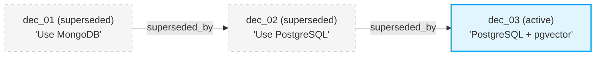

# ✨ Origin

[](LICENSE)
[](pyproject.toml)
[](CONTRIBUTING.md)

**Origin** is a local-first, git-friendly persistent memory layer for AI coding agents. It solves a single core problem: every AI assistant — Claude Code, Cursor, Windsurf, Codex CLI, Aider, or any MCP-compatible tool — begins every session with zero context about your project's architecture, historical decisions, and active conventions. Origin acts as a persistent brain, recording that knowledge as typed, versioned artifacts committed directly to your repository.

> **Works with any agent.** Origin exports context as plain Markdown files (`ORIGIN.md`, `CLAUDE.md`, `.cursorrules`) and exposes an MCP server that any compatible client can connect to. If your agent reads files or speaks MCP, it works with Origin.

---

## 🛠️ System Architecture

Origin stores each artifact as an individual YAML file (git-mergeable, human-readable), backed by a rebuildable SQLite query cache. Three thin adapter layers — CLI, MCP server, and interactive TUI — all route through a shared application service layer. Markdown mirrors are committed to Git for agent consumption.


---

## 🚀 Quickstart

### 1. Installation
Install the package locally:
```bash
pip install -e .
```

### 2. Initialize Origin Workspace
Run this inside your project root directory:
```bash
origin init --name MyAwesomeProject --with-hooks
```
This generates a `.origin/` directory with:
- `config.yaml`: schema configurations.
- `workspace.db`: your local single-table SQLite store.
- Auto-generated mirrors: `decisions.md`, `memory.md`, and `ORIGIN.md`.

### 3. Record Your First Decision
```bash
origin decision add \
  --title "Use PostgreSQL over MongoDB for data layer" \
  --rationale "Strong transactional integrity and native JSON support required." \
  --confidence 0.95 \
  --alternative "MongoDB" \
  --alternative "SQLite" \
  --file "src/db.py"
```

### 4. Keep Agent Context Up to Date
```bash
# Universal — works with any agent that reads project files
origin export --target generic

# Or target a specific editor
origin export --target claude-code   # writes CLAUDE.md
origin export --target cursor        # writes .cursorrules
```
This appends/updates a marked context block inside the target file without clobbering your existing contents.

---

## 🧬 Decision Supersession Chain

When requirements evolve, you can supersede old decisions. Origin preserves the entire historical chain in your database, letting agents inspect *why* changes occurred.



To supersede a decision:
```bash
origin decision supersede dec_01KXBTA5DD6... \
  --title "PostgreSQL + pgvector for embedding support" \
  --rationale "Product requirements shifted to support semantic search indices locally." \
  --confidence 0.90
```

---

## 🖥️ Interactive TUI Dashboard

Launch a real-time terminal dashboard with `origin tui`. It surfaces all decisions, memory, and timeline data in a keyboard-navigable three-panel layout.

```bash
origin tui
```

### Keybindings

| Key | Action |
| :--- | :--- |
| `↑`/`↓` or `j`/`k` | Navigate the decisions list |
| `Enter` | View full decision detail (rationale, alternatives, files) |
| `a` | Accept a proposed decision |
| `r` | Reject a proposed decision |
| `/` | Search across decisions (ESC to clear) |
| `d` | Show full doctor diagnostics |
| `q` | Quit |

### What you see

- **Left panel**: All decisions with status glyphs (`●` active, `◌` proposed, `✕` rejected, `↺` superseded)
- **Top-right**: Memory entries grouped by category (collapsible)
- **Bottom-right**: Activity timeline (newest first, auto-refreshing)
- **Header**: Workspace name, git branch, health indicator, singularity rotation glyph

The TUI auto-polls for changes every 2 seconds — if another agent session writes a decision via MCP while you're watching, it appears automatically.

To try it with a pre-populated workspace:
```bash
python demo_tui.py
```

---

## 🔌 MCP Server (Works with Any MCP Client)

Origin includes a built-in [Model Context Protocol](https://modelcontextprotocol.io/) server. Any MCP-compatible agent — Claude Code, Cursor, Windsurf, Codex CLI, or custom tools — can query and add project memory directly.

### Quick setup for supported editors
```bash
# Claude Code — auto-writes ~/.claude.json
origin connect claude-code

# Cursor — exports .cursorrules and prints MCP config instructions
origin connect cursor
```

### Manual registration (any MCP client)
```bash
origin mcp-config
```
This prints the JSON snippet (`origin-mcp` command + args) you can paste into any MCP client's configuration.

### Available MCP Tools:
- `origin_get_context()`: returns the compiled markdown context bundle.
- `origin_add_decision(...)`: records a new decision.
- `origin_list_decisions(status)`: lists active or superseded ADRs.
- `origin_supersede_decision(...)`: chains a new decision over an old one.
- `origin_set_memory(...)`: updates project conventions.
- `origin_search(...)`: runs SQL searches across key findings.

---

## 🛠️ Command-Line Interface Reference

| Command | Description |
| :--- | :--- |
| `origin init` | Creates `.origin/` folder, YAML directories, and SQLite cache |
| `origin tui` | Launch the interactive terminal dashboard |
| `origin decision add` | Record new architecture decision (interactive or flags) |
| `origin decision add --propose` | Record as a proposed decision (pending human review) |
| `origin decision accept <id>` | Accept and activate a proposed decision |
| `origin decision reject <id>` | Reject a proposed decision |
| `origin decision list` | Lists decisions filtered by status |
| `origin decision list --affects <f>` | Filter decisions by affected file path |
| `origin decision supersede <id>` | Supersede an old decision with a new one |
| `origin memory set <cat> <key> <val>`| Stores or updates a project memory entry |
| `origin memory get <cat> <key>` | Prints the raw value of a memory key to stdout |
| `origin context` | Prints the compiled context bundle |
| `origin search <query>` | Keyword search across decisions and memories |
| `origin export --target <target>` | Exports context to `claude-code`, `cursor`, or `generic` |
| `origin connect <target>` | Export context + auto-configure editor MCP integration |
| `origin doctor` | Workspace integrity check and diagnostics |
| `origin doctor --fix` | Rebuild SQLite index from YAML files and regenerate mirrors |
| `origin migrate` | Migrate a v1.0 workspace to v2.0 filesystem-first format |

---

## 🤝 Contributing

We welcome contributions! Please review [CONTRIBUTING.md](CONTRIBUTING.md) to set up your local development environment, learn how to run tests, and discover how to write custom flat-file exporters.

---

## ⭐ Star the Repo!

If you find Origin helpful for pair programming with AI agents, please **star this repository** to help others discover it!


